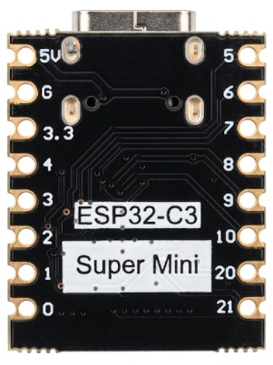
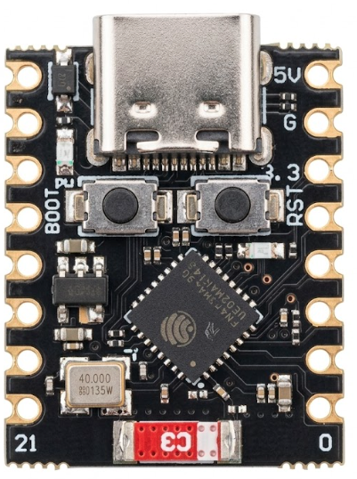
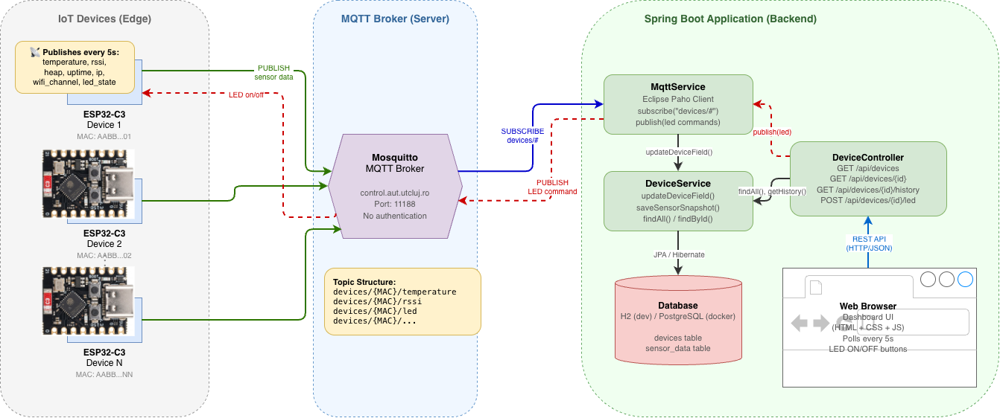
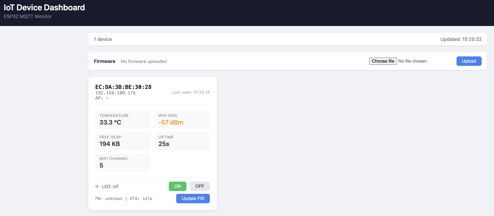
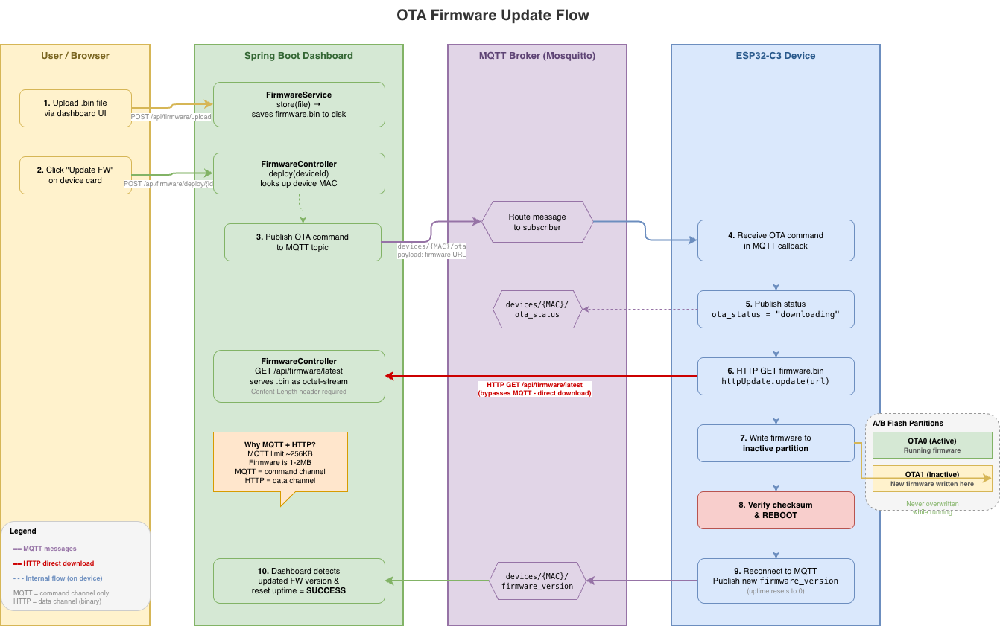

# IoT MQTT ESP32 Demo

End-to-end IoT demo: an ESP32 microcontroller publishes sensor data over MQTT, and a Spring Boot dashboard receives, stores, and visualizes it in real time.

## Documentation Index

| Document | Description |
|----------|-------------|
| **This file** (`README.md`) | Project overview, architecture, how to run and test everything |
| [iot-esp32-app/README.md](iot-esp32-app/README.md) | ESP32 firmware — topics, configuration, how to upload on ESP32 device and verify |
| [iot-esp32-app/esp32-c3-mqtt-guide.md](iot-esp32-app/esp32-c3-mqtt-guide.md) | Beginner guide — Arduino IDE setup, board installation, library configuration |
| [iot-dashboard/README.md](iot-dashboard/README.md) | Spring Boot app — code structure, components, REST API, dependencies |
| [ota-guide.md](ota-guide.md) | OTA firmware update — how it works, setup, deployment walkthrough |
| [architecture.drawio](architecture.drawio) | Editable architecture diagram (open with [draw.io](https://app.diagrams.net)) |
| [ota-flow.drawio](ota-flow.drawio) | OTA update flow diagram (open with [draw.io](https://app.diagrams.net)) |
| [simulate-device.sh](simulate-device.sh) | Shell script to simulate an ESP32 device without hardware |

---

## Hardware Required

### ESP32-C3 Super Mini

This demo uses the **ESP32-C3 Super Mini** development board — a tiny, low-cost microcontroller with built-in WiFi and Bluetooth.

<p align="center">
  
  &nbsp;&nbsp;&nbsp;&nbsp;
  
</p>

**Key specs:**
- RISC-V single-core processor at 160 MHz
- WiFi 802.11 b/g/n
- Built-in LED on GPIO 8
- USB-C connector (no external serial driver needed)

**Where to buy:** [ESP32-C3 Super Mini — Ardushop.ro](https://ardushop.ro/ro/plci-de-dezvoltare/2224-placa-de-dezvoltare-esp32-c3-super-mini-6427854034298.html)

**You also need:** a USB-C data cable (not charge-only) to connect the board to your computer for programming and serial monitoring.

> **No hardware?** You can test the full system without a physical device using the `simulate-device.sh` script described below.

> **Important — before uploading to the ESP32:** Open `sketch_apr2a.ino` and update the WiFi credentials to match your network:
> ```cpp
> const char* ssid = "YOUR_WIFI_NAME";
> const char* password = "YOUR_WIFI_PASSWORD";
> ```
> The ESP32-C3 only supports **2.4 GHz WiFi** — it will not connect to 5 GHz networks. Make sure your access point has a 2.4 GHz band available.

---

## Project Structure

```
01-IoT-mqtt-esp32-demo/
├── iot-esp32-app/                  # ESP32 Arduino firmware
│   ├── sketch_apr2a/
│   │   └── sketch_apr2a.ino       # Arduino sketch (sensor publishing + LED control + OTA)
│   └── esp32-c3-mqtt-guide.md     # Step-by-step setup guide for the ESP32
│
├── iot-dashboard/                  # Spring Boot web application
│   ├── pom.xml                    # Maven dependencies (Spring Boot, JPA, Paho MQTT)
│   ├── Dockerfile                 # Multi-stage Docker build
│   ├── compose.yml                # Docker Compose (PostgreSQL + app)
│   └── src/main/
│       ├── java/com/iotdashboard/
│       │   ├── IoTDashboardApplication.java
│       │   ├── model/             # JPA entities (Device, SensorData)
│       │   ├── repository/        # Spring Data repositories
│       │   ├── dto/               # Request/Response records
│       │   ├── service/           # DeviceService + MqttService + FirmwareService
│       │   └── controller/        # REST API endpoints (DeviceController + FirmwareController)
│       └── resources/
│           ├── application.yml            # Default config (H2 in-memory)
│           ├── application-docker.yml     # Docker config (PostgreSQL)
│           └── static/                    # Web dashboard (HTML/CSS/JS)
│
├── ota-guide.md                   # OTA firmware update guide
└── simulate-device.sh             # Simulates an ESP32 without hardware
```

## How It Works

<p align="center">
  
</p>

### MQTT Topics

Each device uses its MAC address (without colons) as identifier:

| Topic                           | Direction       | Payload        |
|---------------------------------|-----------------|----------------|
| `devices/{MAC}/temperature`     | ESP32 → Broker  | `35.2`         |
| `devices/{MAC}/rssi`            | ESP32 → Broker  | `-52`          |
| `devices/{MAC}/heap`            | ESP32 → Broker  | `280000`       |
| `devices/{MAC}/status`          | ESP32 → Broker  | `42` (uptime)  |
| `devices/{MAC}/wifi_channel`    | ESP32 → Broker  | `6`            |
| `devices/{MAC}/ip`              | ESP32 → Broker  | `192.168.1.45` |
| `devices/{MAC}/mac`             | ESP32 → Broker  | `AA:BB:CC:DD:EE:FF` |
| `devices/{MAC}/ssid`            | ESP32 → Broker  | `MyWiFi`       |
| `devices/{MAC}/led_state`       | ESP32 → Broker  | `on` / `off`   |
| `devices/{MAC}/firmware_version`| ESP32 → Broker  | `1.0.0`        |
| `devices/{MAC}/ota_status`      | ESP32 → Broker  | `downloading` / `failed: reason` |
| `devices/{MAC}/led`             | Broker → ESP32  | `on` / `off`   |
| `devices/{MAC}/ota`             | Broker → ESP32  | Firmware download URL |

### REST API

| Method | Endpoint                    | Description                  |
|--------|-----------------------------|------------------------------|
| GET    | `/api/devices`              | List all devices             |
| GET    | `/api/devices/{id}`         | Get single device            |
| GET    | `/api/devices/{id}/history` | Last 100 sensor readings     |
| POST   | `/api/devices/{id}/led`     | Send LED command (`{"state":"on"}`) |
| POST   | `/api/firmware/upload`      | Upload a `.bin` firmware file        |
| GET    | `/api/firmware/latest`      | Download the stored firmware binary  |
| GET    | `/api/firmware/info`        | Get info about the uploaded firmware |
| POST   | `/api/firmware/deploy/{id}` | Trigger OTA update on a device       |

---

## Running the ESP32 Firmware

See [iot-esp32-app/esp32-c3-mqtt-guide.md](iot-esp32-app/esp32-c3-mqtt-guide.md) for full setup instructions.

1. Open `sketch_apr2a.ino` in Arduino IDE
2. Update WiFi credentials (`ssid` and `password`)
3. Upload to the ESP32-C3 board
4. Open Serial Monitor (115200 baud) to verify it connects and publishes

---

## Running the Spring Boot Dashboard

<p align="center">
  
</p>


### Option 1: Local Development (H2 in-memory database)

```bash
cd iot-dashboard
mvn spring-boot:run
```

Open http://localhost:8080

### Option 2: Docker Compose (PostgreSQL)

```bash
cd iot-dashboard
docker compose up --build
```

Open http://localhost:8080

To stop: `docker compose down` (add `-v` to also remove the database volume).

### H2 Console (local dev only)

Available at http://localhost:8080/h2-console with:
- JDBC URL: `jdbc:h2:mem:iotdb`
- User: `sa`
- Password: *(empty)*

---

## Testing Without Hardware

Use the simulator script to publish fake sensor data to the MQTT broker:

```bash
# Simulate one device (default MAC: AABBCCDDEEFF)
./simulate-device.sh

# Simulate with a custom MAC
./simulate-device.sh A1B2C3D4E5F6

# Simulate multiple devices (run in separate terminals)
./simulate-device.sh DEVICE000001
./simulate-device.sh DEVICE000002
```

Requires `mosquitto_pub`:
- macOS: `brew install mosquitto`
- Linux: `sudo apt install mosquitto-clients`

### Manual MQTT Testing

```bash
# Subscribe to all device messages
mosquitto_sub -h control.aut.utcluj.ro -p 11188 -t "devices/#" -v

# Publish a single temperature reading
mosquitto_pub -h control.aut.utcluj.ro -p 11188 -t "devices/TEST123/temperature" -m "25.5"

# Send LED command
mosquitto_pub -h control.aut.utcluj.ro -p 11188 -t "devices/TEST123/led" -m "on"
```

---

## OTA Firmware Updates

The dashboard supports Over-The-Air firmware updates — upload a compiled `.bin` file through the web UI and deploy it to any connected device without plugging in a USB cable.

<p align="center">
  
</p>

1. Upload a `.bin` file using the **Firmware** section at the top of the dashboard
2. Click **Update FW** on a device card
3. The ESP32 downloads the firmware over HTTP, flashes itself, and reboots

For the full walkthrough and technical details, see [ota-guide.md](ota-guide.md).

> **Important:** The `firmware.download-url` setting in `application.yml` must point to the server's **LAN IP address** (e.g., `http://192.168.1.100:8080/api/firmware/latest`), not `localhost` — the ESP32 needs to reach the server over the network.

---

## MQTT Broker

This demo uses a shared MQTT broker — no installation required:

| Setting        | Value                     |
|----------------|---------------------------|
| Host           | `control.aut.utcluj.ro`   |
| MQTT Port      | `11188`                   |
| WebSocket Port | `11190`                   |
| Authentication | Anonymous (none required) |
